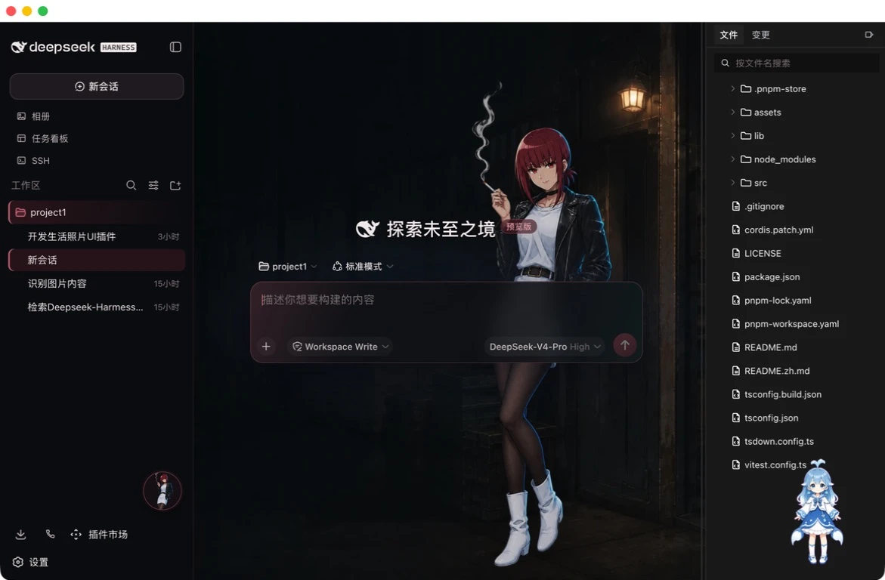
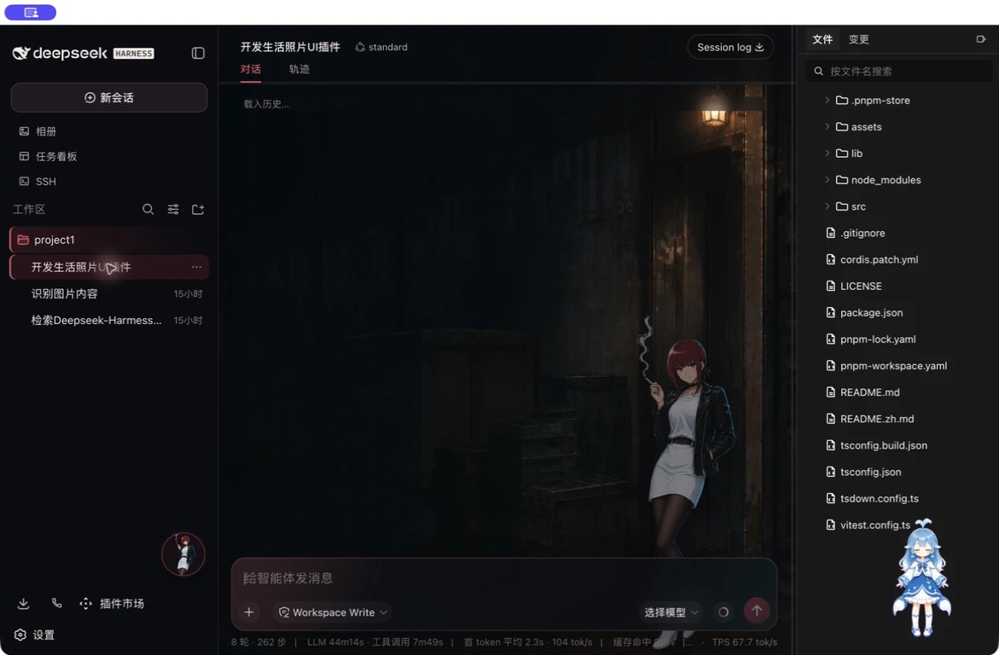
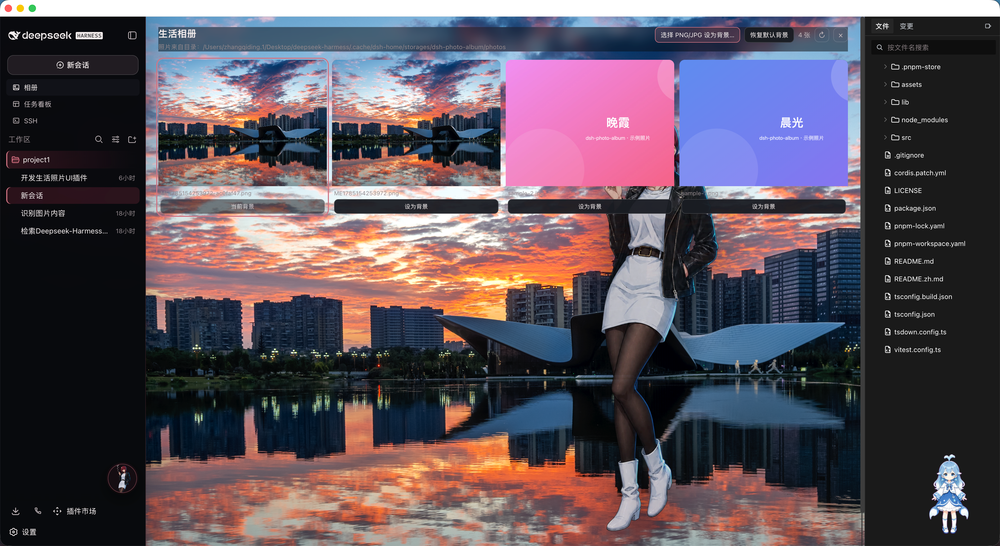

# 🌙 Yamada Night Shift · 山田的夜班

给 [DeepSeek Harness](https://github.com/deepseek-ai/DeepSeek-Harness) 换上一套真正可用的夜间动漫工作台：山田凉主题、macOS DSH Desktop / DSH Web、本地相册和 PNG/JPG 持久背景。

> Night-only presentation skin for DSH Web and macOS DSH Desktop, plus an optional local photo-album companion. The plugins are presentation-only: they do not inject model services, upload photos, or replace native DSH behavior.

结构参考 [Small-tailqwq/dsh-deep-whale](https://github.com/Small-tailqwq/dsh-deep-whale)：先看效果，再按目标平台安装；皮肤和相册保持为两个可独立启用、卸载即恢复的包。

> ⭐ 喜欢这套 UI，欢迎点 Star；安装遇到问题，请带上 DSH 版本、profile 和截图开 Issue。

### 让 DSH 帮你安装（推荐）

把下面这句话直接发给你的 DSH：

> 安装这个 UI 插件：<https://github.com/ZhangQiding/dsh-anime-ui>

如果你习惯终端，下面的手动安装只需 30 秒。

## 效果预览 / Preview

| 欢迎页 / Welcome | 对话页 / Conversation | 相册背景 / Album background |
| --- | --- | --- |
|  |  |  |

右侧截图来自真实 DSH Desktop：相册顶部可以直接选择 PNG/JPG，卡片或灯箱可以把本地照片设为背景。截图保留了实际运行时的相册路径，方便对照功能；它不会被插件上传或写入运行时 bundle。

## 你会得到 / Packages

| 包 | 作用 | 许可证 |
| --- | --- | --- |
| `@dsh-external/dsh-client-ui-skin-yamada-night-shift` | 山田夜班皮肤：欢迎页全身构图、对话页右侧安全构图、夜间配色 | CC BY-NC-SA 4.0 |
| `dsh-photo-album` | 可选相册伴侣：目录扫描、灯箱、PNG/JPG 原生选择器、持久背景 | MIT |

皮肤可以单独使用；只有同时安装两个包，**相册 → 设为背景** 才会驱动山田皮肤的背景。

## 安装 / Install

需要 macOS DSH Desktop 或 DSH Web，以及 Node.js 22+。先克隆仓库并进入根目录：

```sh
git clone https://github.com/ZhangQiding/dsh-anime-ui.git
cd dsh-anime-ui
```

### DSH Web

```sh
dsh plugin --profile web add "$PWD/yamada-night-shift"
dsh plugin --profile web add "$PWD/photo-album"   # 可选，但相册背景需要它
```

注册后刷新 DSH Web。已注册的本地链接会直接读取仓库里的 `lib/`，重建后刷新页面即可验证改动。

### macOS DSH Desktop

```sh
dsh plugin --profile desktop add "$PWD/yamada-night-shift"
dsh plugin --profile desktop add "$PWD/photo-album"   # 可选，但相册背景需要它
```

如果 `dsh` 不在 `PATH`，请使用 DSH Desktop 内置 CLI；包目录和参数不变：

```sh
ELECTRON_RUN_AS_NODE=1 '/Applications/DSH Desktop.app/Contents/MacOS/DSH Desktop' \
  --expose-internals \
  '/Applications/DSH Desktop.app/Contents/Resources/app.asar.unpacked/lib/desktop-cli.js' \
  plugin --profile desktop add "$PWD/yamada-night-shift"
```

把最后的目录换成 `"$PWD/photo-album"` 即可安装相册伴侣。首次注册、切换、升级或卸载后，请退出并重新打开打包版 DSH Desktop 2.0.1；这是宿主 boot graph 的生命周期要求。

## 相册背景 / Album background

安装两个包并重启后，在侧边栏打开 **相册**：

1. 点击 **选择 PNG/JPG 设为背景…**，在 Finder 中选择 `.png`、`.jpg` 或 `.jpeg`。文件会复制到插件自己的 `DSH_HOME/storages/dsh-photo-album/photos/`，并立即应用。
2. 需要浏览整个文件夹时，在 **设置 → 相册** 配置照片目录和是否递归，再从网格卡片或灯箱点击 **设为背景**。
3. 顶部的 **恢复默认背景** 会清除当前选择并回到山田内置夜景。

直接选择支持 PNG/JPG/JPEG，目录模式还支持 WebP、GIF、AVIF、BMP 和 SVG；单个导入文件上限为 25 MB。背景选择保存在插件自有 JSON 状态中，不依赖 `localStorage`，因此 Desktop 换端口或冷启动后仍可恢复。照片只通过 loopback 媒体路由读取，不上传、不复制进仓库。

更多相册配置、目录模式和安全边界见 [`photo-album/README.zh.md`](photo-album/README.zh.md) / [`photo-album/README.md`](photo-album/README.md)。

## 切换、更新与卸载 / Switch, update, uninstall

皮肤包 id 为 `ui-skin-yamada-night-shift`。同一 profile 只启用一个 `ui-skin-*` 皮肤；切换时将旧条目的 `disabled` 设为 `true`，再启用新条目。更新本地链接后重新构建对应包，Web 刷新，Desktop 退出并重开。

```sh
# 更新本地 bundle（按需执行）
(cd yamada-night-shift && npm install && npm run build && npm test)
(cd photo-album && pnpm install && pnpm run build && pnpm run typecheck && pnpm run test)

# 卸载
dsh plugin --profile web remove @dsh-external/dsh-client-ui-skin-yamada-night-shift
dsh plugin --profile web remove dsh-photo-album
dsh plugin --profile desktop remove @dsh-external/dsh-client-ui-skin-yamada-night-shift
dsh plugin --profile desktop remove dsh-photo-album
```

卸载后重启目标实例；皮肤会清理自己创建的 DOM、CSS、favicon、标题和背景状态，不会修改 DSH 源码。

## 开发 / Development

两个包各自独立构建，不需要 checkout DSH 源码：

```sh
cd yamada-night-shift
npm install
npm run build
npm test
npm pack --dry-run

cd ../photo-album
pnpm install
pnpm run typecheck
pnpm run test
pnpm run build
```

提交前建议同时运行 `git diff --check`。运行时素材会被嵌入已提交的 `lib/` bundle，因此使用者可以直接安装本仓库目录，不依赖远程图片。

## 仓库结构 / Repository layout

```text
yamada-night-shift/  皮肤源码、预构建 lib、运行时素材和真实预览
photo-album/         可选相册源码、预构建 lib、示例 PNG/JPG/SVG
docs/                迁移上下文、验收记录、资产清单和截图证据
assets/              最终母版与从“考试”项目迁移的历史图片
pic/                 用户提供的参考图（原文件名保留）
```

可直接复制的中文 / English 宣传文案见 [`docs/SHARE.md`](docs/SHARE.md)。

## 兼容性 / Compatibility

- DSH Web：桌面宽屏和窄屏响应式布局；安装后刷新页面。
- DSH Desktop：当前发布目标为 macOS，已按 DSH Desktop 2.0.1 的本地链接流程验收。
- 皮肤是 Night-only 视觉，不提供自动浅色主题。
- 相册背景联动需要同时安装 `yamada-night-shift/` 与 `photo-album/`。

## 来源、许可与反馈 / Attribution, license, feedback

生命周期脚手架和接入方式参考 [dsh-deep-whale](https://github.com/Small-tailqwq/dsh-deep-whale) 的 `maid-atelier` 适配；本仓库不包含该项目的女仆图片。山田皮肤、视觉资产和迁移材料按 **CC BY-NC-SA 4.0** 发布；独立相册伴侣按目录内 **MIT** 发布，详情见各目录的 `LICENSE` 与 `NOTICE`。

如果这个皮肤对你有用，欢迎在 GitHub 点一个 ⭐；遇到安装或兼容问题，请附上 DSH Web/Desktop 版本、profile 和复现步骤后开 Issue。
